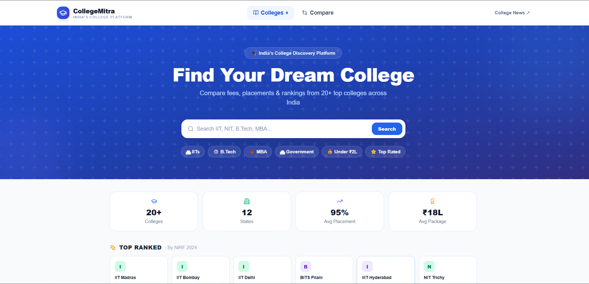
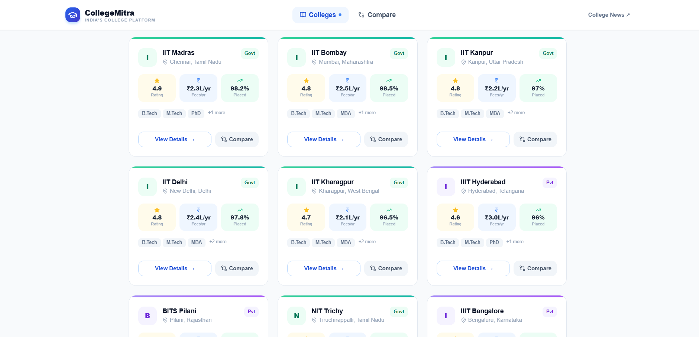

# 🎓 CollegeMitra — Find Your Dream College

> India's College Discovery Platform. Search, explore, and compare top colleges side by side.

**[🌐 Live Demo](https://collegemitra-gray.vercel.app)** • **[📂 GitHub](https://github.com/Nidhi782/CollegeMitra)**

---

## 📸 Preview




> Search 20+ top Indian colleges, filter by state, type, course & fees, and compare them side by side.

---

## ✨ Features

- 🔍 **Live Search** — Search colleges by name instantly
- 🎛️ **Smart Filters** — Filter by State, Type (Govt/Private), Course, and Max Fees
- ⚡ **Quick Chips** — One-click filters for IITs, B.Tech, MBA, Government, Top Rated
- 🏫 **College Detail Page** — Full profile with stats, courses, placements & reviews
- ⚖️ **Compare Colleges** — Side-by-side comparison of 2–3 colleges with highlights
- 🟢 **Best Value Highlights** — Green = best metric, Blue = lowest fees
- 📱 **Fully Responsive** — Works on mobile, tablet, and desktop
- 🔗 **Shareable Links** — Copy college page link with one click

---

## 🛠️ Tech Stack

### Frontend
| Technology | Purpose |
|---|---|
| Next.js 14 | React framework, routing, SSR |
| TypeScript | Type safety |
| Tailwind CSS | Styling |
| Lucide React | Icons |

### Backend
| Technology | Purpose |
|---|---|
| Express.js | REST API server |
| Prisma ORM | Database queries |
| Neon PostgreSQL | Serverless database |
| TypeScript | Type safety |

### Deployment
| Service | What's deployed |
|---|---|
| Vercel | Frontend |
| Render | Backend API |

---

## 📁 Project Structure

```
CollegeMitra/
├── frontend/
│   ├── app/
│   │   ├── page.tsx                  # Homepage — search, filters, college listing
│   │   ├── colleges/[id]/page.tsx    # College detail page
│   │   ├── compare/page.tsx          # Compare colleges page
│   │   ├── layout.tsx                # Root layout
│   │   └── globals.css               # Global styles
│   ├── components/
│   │   ├── Navbar.tsx                # Top navigation
│   │   ├── Footer.tsx                # Footer
│   │   ├── CollegeCard.tsx           # College card component
│   │   ├── CompareBar.tsx            # Floating compare bar
│   │   └── Toast.ts                  # Toast notifications
│   └── lib/
│       └── api.ts                    # API calls + fallback data
│
└── backend/
    ├── src/
    │   ├── index.ts                  # Express server + all API routes
    │   ├── seed.ts                   # Seeds 20 colleges into DB
    │   └── prisma.ts                 # Prisma client
    └── prisma/
        └── schema.prisma             # College table schema
```

---

## 🚀 Getting Started

### Prerequisites
- Node.js 18+
- npm
- A [Neon](https://neon.tech) PostgreSQL database

### 1. Clone the repository

```bash
git clone https://github.com/Nidhi782/CollegeMitra.git
cd CollegeMitra
```

### 2. Setup Backend

```bash
cd backend
npm install
```

Create a `.env` file in the `backend/` folder:

```env
DATABASE_URL=your_neon_pooled_connection_url
DIRECT_URL=your_neon_direct_connection_url
PORT=5000
```

Run Prisma migrations and seed the database:

```bash
npx prisma migrate dev
npm run db:seed
```

Start the backend server:

```bash
npm run dev
```

Backend runs at `http://localhost:5000`

### 3. Setup Frontend

```bash
cd ../frontend
npm install
```

Create a `.env.local` file in the `frontend/` folder:

```env
NEXT_PUBLIC_API_URL=http://localhost:5000
```

Start the frontend:

```bash
npm run dev
```

Frontend runs at `http://localhost:3000`

---

## 🔌 API Endpoints

| Method | Endpoint | Description |
|---|---|---|
| GET | `/colleges` | Get all colleges (supports search & filters) |
| GET | `/colleges/:id` | Get a single college by ID |

### Query Parameters for `/colleges`

| Param | Type | Description |
|---|---|---|
| `search` | string | Search by college name |
| `state` | string | Filter by state |
| `type` | string | Filter by Government / Private |
| `course` | string | Filter by course offered |
| `maxFees` | number | Filter by max annual fees |
| `page` | number | Page number for pagination |

---

## 🗄️ Database Schema

```prisma
model College {
  id             Int      @id @default(autoincrement())
  name           String
  location       String
  state          String
  type           String   // Government | Private
  rating         Float
  fees           Int
  placementRate  Float
  avgPackage     Int
  totalStudents  Int
  established    Int
  accreditation  String
  description    String
  courses        String[]
  topRecruiters  String[]
}
```

---

## 🌐 Deployment

### Frontend → Vercel
1. Push code to GitHub
2. Import repo on [vercel.com](https://vercel.com)
3. Set root directory to `frontend`
4. Add environment variable: `NEXT_PUBLIC_API_URL=your_render_backend_url`
5. Deploy

### Backend → Render
1. Import repo on [render.com](https://render.com)
2. Set root directory to `backend`
3. Build command: `npm install && npx prisma generate`
4. Start command: `npm start`
5. Add environment variables: `DATABASE_URL`, `DIRECT_URL`

---

## 👩‍💻 Author

**Nidhi Kumari**

[](https://www.linkedin.com/in/nidhi-kumari-818118319/)
[](https://github.com/Nidhi782)

---

## 📄 License

This project is open source and available under the [MIT License](LICENSE).
